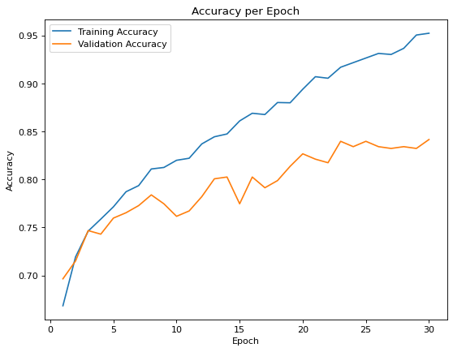
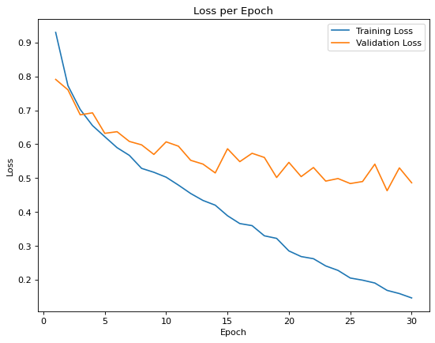

# Classification Of Diabetic Retinopathy Using Machine Learning

This project focuses on using machine learning techniques, specifically a neural network with the **VGG16 architecture**, for the detection of diabetic retinopathy. The code includes data preprocessing, model creation, training, and performance evaluation.

Certainly! Here's a brief explanation of the provided code that you can include in your README:

## Code Overview

### 1. Variables

- **dim:** Image dimensions (176x208 pixels).
- **test_split_percent:** Percentage of data for testing (10%).
- **validation_split_percent:** Percentage of data for validation (20%).
- **zoom:** Range for image zooming during training.
- **bright_range:** Range for adjusting image brightness.
- **layers_unlocked:** Flag to determine if pre-trained layers should be unlocked.
- **lr:** Learning rate for the optimizer (0.0001).
- **batch:** Batch size for model fitting (20).
- **eps:** Number of training epochs (30).
- **momentum:** Momentum of the Stochastic Gradient Descent (SGD) optimizer (0.9).
- **save_model_name:** Auto-generated name for saving the model.

### 2. Import Data

- Data is loaded using `flow_from_directory` from specified directories.
- Train-test split is performed.

### 3. Sanity Checks

- Checks and displays array dimensions, images, and channels.
- Preprocesses images.

### 4. Create Model

- Imports pre-trained VGG16 model with specified layers trainable/untrainable.
- Add new fully connected layers for classification.

### 5. Train the Model

- Compiles the model using SGD optimizer and categorical cross-entropy loss.
- Fits the model on the training data with validation split.

### 6. Plots and Values

### 7. Performance Evaluation

- Train Accuracy: 97.44%
- Validation Accuracy: 84.17%
- Test Accuracy: 83.30%

